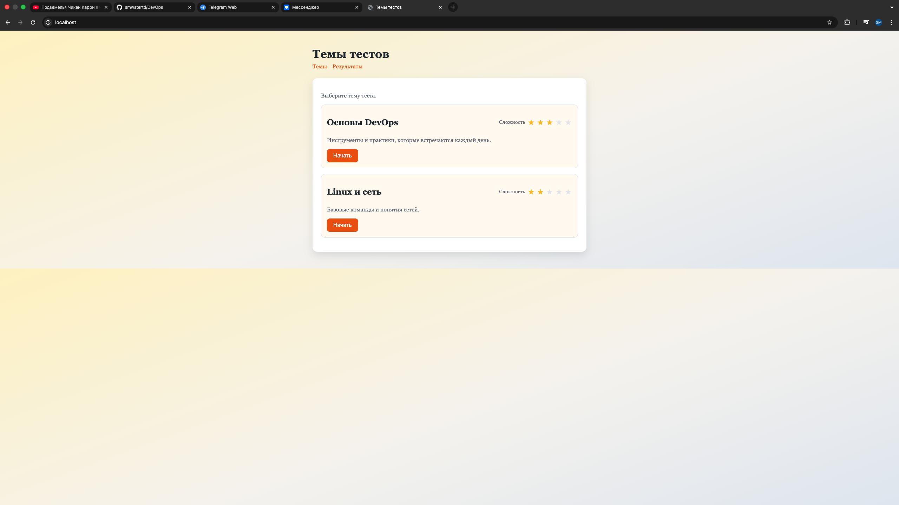
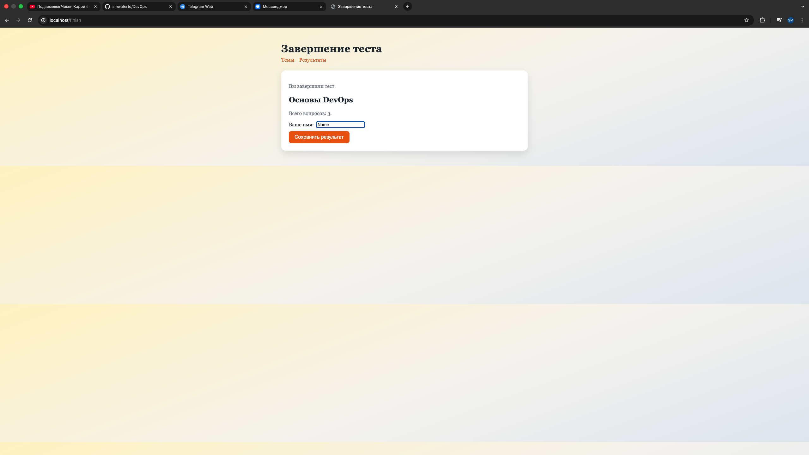

# Работу выполнил Кораблев Данил Денисович, индивидуальный план

# Отчёт по развёртыванию веб-приложения на PHP

## 1. Введение

Цель работы — разработать и развернуть веб-приложение для проведения тестирования развертывания приложений. Реализовать два способа развёртывания: на виртуальной машине без контейнеров и с использованием Docker Compose.

Стек технологий:
- Язык: PHP 8.1
- Веб-сервер: NGINX
- СУБД: MySQL 8.4
- Контейнеризация: Docker + Docker Compose
- ОС: Ubuntu 22.04

---

## 2. Архитектура приложения

Общая схема работы:
```
Браузер → NGINX (порт 80) → PHP-FPM → MySQL (127.0.0.1:3306)
```

Структура проекта:

```
/var/www/poll-app/
├── public/
│   └── index.php
├── src/
│   ├── config.php
│   ├── db.php
│   └── controllers.php
├── templates/
│   ├── layout.php
│   ├── home.php
│   ├── question.php
│   ├── finish.php
│   └── results.php
├── deployment/
│   ├── native.sh
│   └── docker.sh
├── docker/
│   ├── nginx.conf
│   └── php/
│       ├── Dockerfile
│       └── php.ini
├── schema.sql
├── .env
├── docker-compose.yml
└── Makefile
```

Ключевые моменты:
- public/ — единственная директория, доступная через веб
- src/ — блокируется в nginx
- .env — блокируется в nginx, содержит пароли

---

## 3. Развёртывание без контейнеров

### Описание виртуальной машины

- ОС: Ubuntu 22.04 LTS
- Виртуализация: VirtualBox
- RAM: 2 GB

Открытые порты:
- Порт 80 — HTTP (NGINX)
- Порт 22 — SSH

Закрытые порты:
- Порт 3306 — MySQL (доступен только на 127.0.0.1)

### Установка компонентов

Фрагмент из deployment/native.sh (install):
```bash
apt update && apt install -y software-properties-common
add-apt-repository -y ppa:ondrej/php
apt update && apt install -y nginx php8.1-fpm php8.1-mysql mysql-server curl
```

Расположение конфигурации:
- Главный конфиг: /etc/nginx/nginx.conf
- Конфиг сайта: /etc/nginx/sites-available/poll-app
- Активные сайты: /etc/nginx/sites-enabled/

Расположение конфигурации PHP:
- PHP-FPM pool: /etc/php/8.1/fpm/pool.d/www.conf
- PHP.ini: /etc/php/8.1/fpm/php.ini
- Socket: /run/php/php8.1-fpm.sock

Расположение конфигурации MySQL:
- Главный конфиг: /etc/mysql/mysql.conf.d/mysqld.cnf
- Bind address: 127.0.0.1

### Настройка NGINX

Файл /etc/nginx/sites-available/poll-app:

```nginx
server {
    listen 80;
    server_name _;

    root /var/www/poll-app/public;
    index index.php;

    location / {
        try_files $uri /index.php?$query_string;
    }

    location ~ \.php$ {
        include fastcgi_params;
        fastcgi_param SCRIPT_FILENAME $document_root$fastcgi_script_name;
        fastcgi_pass unix:/run/php/php8.1-fpm.sock;
    }

    location ^~ /src {
        deny all;
    }

    location ~ /\.env {
        deny all;
    }
}
```

Активация:
```bash
sudo ln -s /etc/nginx/sites-available/poll-app /etc/nginx/sites-enabled/
sudo rm /etc/nginx/sites-enabled/default
sudo nginx -t
sudo systemctl reload nginx
```

### Настройка базы данных

Фрагмент из deployment/native.sh (setup):
```bash
mysql -e "CREATE DATABASE IF NOT EXISTS poll_app CHARACTER SET utf8mb4 COLLATE utf8mb4_unicode_ci;"
mysql -e "CREATE USER IF NOT EXISTS 'poll_user'@'localhost' IDENTIFIED BY '$DB_PASS';"
mysql -e "GRANT ALL PRIVILEGES ON poll_app.* TO 'poll_user'@'localhost';"
mysql -e "FLUSH PRIVILEGES;"
mysql -u poll_user -p"$DB_PASS" poll_app < "$APP_DIR/schema.sql"
```

Расположение данных и прав:
- Схема БД: /var/www/poll-app/schema.sql
- Пользователь poll_user имеет права только на БД poll_app
- Root-доступ к MySQL возможен только через sudo mysql

### Конфигурация приложения

Фрагмент из deployment/native.sh (setup):
```bash
cat > "$APP_DIR/.env" <<EOF
DB_HOST=127.0.0.1
DB_PORT=3306
DB_NAME=poll_app
DB_USER=poll_user
DB_PASS=$DB_PASS
DB_ROOT_PASS=unused
EOF
```

Расположение и права:
- Файл .env создается в /var/www/poll-app/.env
- Права: 600 на .env, владелец www-data

### Меры безопасности

Пароли не зашиты в коде:
- Используется .env файл
- .env имеет права 600
- .env блокируется в NGINX конфиге
- Пароль запрашивается при установке через скрипт

Управление портами:
- Порт 80 — открыт
- Порт 22 — открыт
- Порт 3306 — НЕ открыт во внешнюю сеть

Конфигурация MySQL:
```ini
bind-address = 127.0.0.1
```

Ограничение прав пользователя БД:
- Создан отдельный пользователь poll_user
- Права только на одну БД poll_app
- Root-доступ только через sudo mysql

Права на файлы:
- Владелец: www-data
- Директории: 755
- Файлы: 644
- .env: 600

---

## 4. Развёртывание с Docker Compose

Команды из deployment/docker.sh:
```bash
docker compose up -d && echo "running"
docker compose down && echo "stopped"
docker compose restart
docker compose down --remove-orphans && echo "cleaned"
```

Расположение конфигурации Docker:
- docker-compose.yml
- docker/nginx.conf
- docker/php/Dockerfile
- docker/php/php.ini

### Структура проекта

```
~/devops/
├── docker-compose.yml
├── .env
├── docker/
│   ├── nginx.conf
│   └── php/
│       ├── Dockerfile
│       └── php.ini
├── public/
├── src/
├── templates/
└── schema.sql
```

### docker-compose.yml

```yaml
services:
  db:
    image: mysql:8.4
    command:
      - --character-set-server=utf8mb4
      - --collation-server=utf8mb4_unicode_ci
    environment:
      MYSQL_DATABASE: ${DB_NAME}
      MYSQL_USER: ${DB_USER}
      MYSQL_PASSWORD: ${DB_PASS}
      MYSQL_ROOT_PASSWORD: ${DB_ROOT_PASS}
    volumes:
      - db_data:/var/lib/mysql
      - ./schema.sql:/docker-entrypoint-initdb.d/schema.sql:ro
    networks:
      - app_net

  php:
    build:
      context: .
      dockerfile: docker/php/Dockerfile
    volumes:
      - ./:/var/www
      - ./docker/php/php.ini:/usr/local/etc/php/conf.d/app.ini:ro
    environment:
      DB_HOST: db
      DB_PORT: 3306
      DB_NAME: ${DB_NAME}
      DB_USER: ${DB_USER}
      DB_PASS: ${DB_PASS}
    networks:
      - app_net

  nginx:
    image: nginx:1.27
    ports:
      - "80:80"
    volumes:
      - ./:/var/www:ro
      - ./docker/nginx.conf:/etc/nginx/conf.d/default.conf:ro
    depends_on:
      - php
    networks:
      - app_net

volumes:
  db_data:

networks:
  app_net:
    driver: bridge
```

Ключевые моменты:
- depends_on гарантирует порядок запуска
- networks: app_net — изолированная сеть
- volumes — персистентное хранилище для MySQL
- Порт 3306 не опубликован в ports

### Dockerfile для PHP

Файл docker/php/Dockerfile:

```dockerfile
FROM php:8.1-fpm-alpine

RUN docker-php-ext-install pdo_mysql

WORKDIR /var/www
```

### Конфигурация NGINX

Файл docker/nginx.conf:

```nginx
server {
    listen 80;
    server_name _;

    root /var/www/public;
    index index.php;

    location / {
        try_files $uri /index.php?$query_string;
    }

    location ~ \.php$ {
        include fastcgi_params;
        fastcgi_param SCRIPT_FILENAME $document_root$fastcgi_script_name;
        fastcgi_pass php:9000;
    }

    location ^~ /src {
        deny all;
    }

    location ~ /\.env {
        deny all;
    }
}
```

### Сетевая изоляция
MySQL доступен только внутри сети app_net. Снаружи доступен только порт 80 (NGINX).

### Меры безопасности

Пароли через environment:
- Используется .env файл
- Docker Compose читает переменные через ${VAR}

Изоляция сети:
- MySQL не публикует порт 3306 наружу
- Используется внутренняя сеть app_net
- Доступ к БД только из контейнера php

Минимальные привилегии:
- PHP-FPM работает от пользователя www-data
- Используется образ php:8.1-fpm-alpine
- Не используется privileged режим

Volumes для данных:
- MySQL хранятся в именованном volume db_data
- Данные не теряются при пересоздании контейнера

## Пример работы приложения




